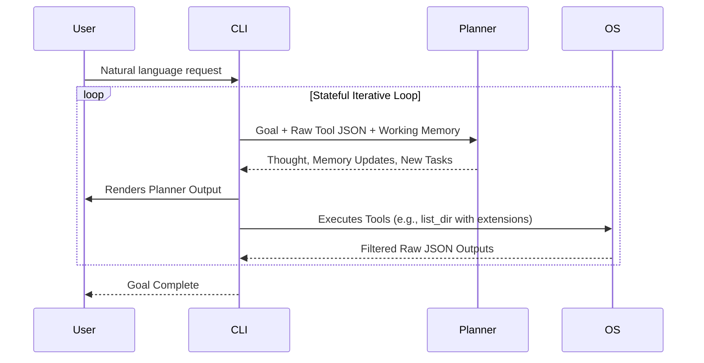

# Nexus Kernel V2
A high-speed, deterministic AI-native Workflow Operating System. Nexus V2 replaces traditional multi-phase agent architectures with a direct-to-planner data pipeline, robust JSON parsing, and surgical Extension-First file targeting.

---

## ⚡ Architectural Breakthroughs

Nexus V2 abandons the slow, standard "Agentic" loops (like ReAct or multi-agent debate) in favor of a **Kernel Planner Architecture**. We engineered several creative solutions to drastically reduce LLM latency and context window bloat:

### 1. Direct Data Pipeline (No Perception Phase)
Traditional agents use a "Perception Engine" to summarize tool outputs before feeding them to a Planner. We proved this causes severe latency and hallucination. 
In Nexus V2, the CLI bypasses the Perception Engine entirely and streams **raw, minified JSON tool outputs directly into the Planner's memory**. To prevent context bloat, the Planner writes state updates directly into a `working_memory` dictionary, which is passed forward, while discarding old tool JSON.

### 2. Extension-First Targeting (Context Reduction)
File system discovery is the hardest problem for autonomous agents. If an agent runs `search_files` on `C:\`, it will crash the context window.
We solved this by implementing **Extension-First Targeting** natively into the `list_dir` and `search_files` tools:
- The Planner is strictly instructed to determine required file types first (e.g., `['.pdf', '.docx']`).
- When it calls `list_dir(extensions=['.pdf'])`, the Python backend traverses the file tree but silently drops every non-matching file before returning the tree to the LLM.
- This allows the LLM to safely increase `max_depth` to 10+, scanning massive drives in a single turn without context explosion.

### 3. Metadata RAG (Pre-Embedding Filtering)
When `search_files` finds hundreds of files, returning them all would overload the LLM. 
Instead of instantly chunking and embedding documents (which is slow), Nexus V2 runs **Metadata RAG**. It takes the file paths, sizes, and extensions, runs Cosine Similarity against the LLM's query, and returns only the top 50 paths. We further optimized this by applying the `extensions` filter *before* the Metadata RAG triggers, meaning we never embed irrelevant `.json` or `.temp` files.

### 4. Unconstrained High-Speed Inference
To maximize speed on local models (like `qwen2.5:7b`), we disabled constrained JSON grammar generation (`format="json"`). Grammar constraints force llama.cpp to evaluate valid paths token-by-token, halving generation speed.
To handle the resulting unconstrained (and occasionally malformed) JSON, we built a 3-layer resilient parser in the backend:
1. `json.loads(strict=False)`
2. `yaml.safe_load()` (Flawlessly parses JSON with single-quotes or unquoted keys)
3. `ast.literal_eval()`

### 5. Strict Path Provenance (Anti-Hallucination)
LLMs love to hallucinate paths like `C:\Users\default\Documents`. 
Nexus V2 features aggressive system prompt engineering that explicitly forbids variable substitution or path guessing. The Planner is hard-coded to require **Strict Path Provenance**, meaning it can only use paths it has physically seen returned by `list_dir` in previous turns. If it queries the `/` root, the tools dynamically return hints to force the LLM to explore drive letters rather than guessing.

---

## 🏗️ Core Components

* **`planner/live_planner.py`**: The brain of the Kernel. Receives raw tool JSON, updates working memory, and outputs a Task Graph in a single turn.
* **`nexus_cli.py`**: The orchestration loop. Executes the Task Graph deterministically and handles the rolling memory windows.
* **`infrastructure/tools/file/`**: The deterministic OS endpoints. Tools like `list_dir_tool` and `search_tool` are heavily optimized for extension filtering and recursion caps.

---

## 🔄 Execution Flow



## 🚀 Getting Started

```bash
# Clone the repository
git clone <repository-url>
cd Nexus

# Run the CLI
python nexus_cli.py
```
